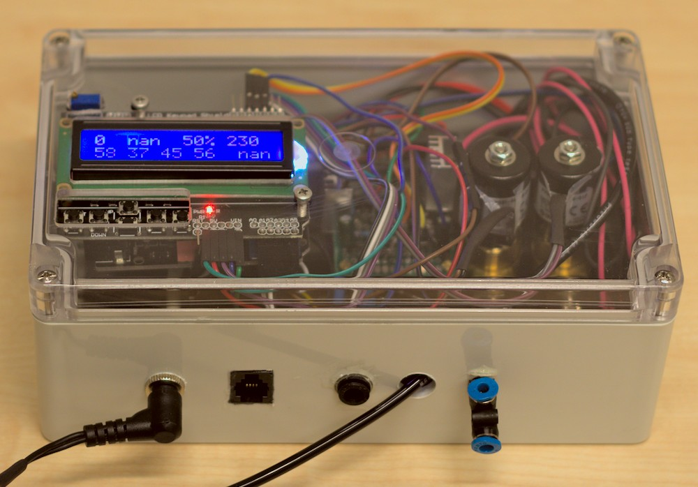

# Humidistat


[](https://zenodo.org/badge/latestdoi/288475918)

This repository contains the Arduino firmware that implements a humidistat (humidity controller) by actuating two
solenoid valves. The firmware can be used on a variety of 
[Arduino-compatible boards](https://docs.platformio.org/en/latest/frameworks/arduino.html#boards), but is developed for
 and tested on the Arduino Uno and Teensy LC.



Besides the Arduino firmware, it contains a real-time monitoring/logging tool written in Python, which communicates 
with the MCU over serial.

## Arduino
### Dependencies
[PlatformIO Core](https://docs.platformio.org/en/latest/core/installation.html) is required for this step.

### Configuration
Several configuration parameters are hardcoded in `config.h` that you might want/need to check. These include:

- Connected hardware options (sensor, display, and input)
- Serial symbol rate
- EEPROM settings
- Arduino I/O pin numbers (for sensor, buttons, LCD, solenoid valves, thermistors)
- PID/logger/sensor interval
- PID parameters:
  - Low CV value (deadband)
  - Gains (Kp, Ki, Kd)
- PWM frequency

Make sure to set these parameters to their appropriate values before compilation.

### Installation
With the MCU board connected over USB, compile the firmware and upload it to the MCU:

```console
foo@bar:~$ platformio run --target upload
```

### Usage
On powerup, the MCU shows a splash screen followed by an info screen printing the active tuning parameters.
Subsequently, the system is ready for use. An outline of the UI is shown below.


The values shown on the display are:

- Mode: 0 for manual, 1 for auto.
- PV: Process variable, i.e. the current, measured humidity in the chamber.
- SP: Setpoint, i.e. the desired humidity. This blinks if it is too far from the PV.
- CV: Control variable, representing the state of the valves from lowValue to 255.
- MOSFET/Solenoid temperature in Celsius.
- Chamber temperature in Celsius.

It starts in manual (open-loop) mode by default. Press SELECT to switch the
controller into auto mode. Press LEFT/RIGHT for coarse adjustment of the setpoint, and DOWN/UP for fine adjustment. In
manual mode, the same buttons are used to adjust the control variable.

## Serial monitor
The humidistat can operate fully in a standalone manner, but it is possible to connect it to a PC over serial (USB)
running a Python script for real-time monitoring and recording of data.

### Dependencies
The serial monitor requires at least Python 3.6. It depends on Numpy and Pandas for data structures, on PySerial for
communicating with the Humidistat MCU, and on Matplotlib and PyQt5 for plotting.

The dependencies can be installed in a virtualenv using Pipenv:

```console
foo@bar:~$ pipenv install
foo@bar:~$ pipenv shell
(Humidistat) foo@bar:~$ 
```

If you do not have Pipenv, you can install with `pip install pipenv`.

### Usage
With the Arduino connected over USB, run the serial monitor:

```console
foo@bar:~$ pipenv shell
(Humidistat) foo@bar:~$ utils/monitor.py
```

The Arduino will reset when the serial port is opened. After connection is established, a window will open in which the
data is plotted in real-time.

When the serial monitor is closed (by SIGINT), it will save the data to file, in (gzipped) CSV format.

## Developer documentation
Developer documentation is available at https://compizfox.github.io/Humidistat/.

## Publication
The device for which this firmware is intended, is described in the following paper:

Veldscholte, L.B., Horst, R.J. & de Beer, S.  
Design, construction, and testing of an accurate low-cost humidistat for laboratory-scale applications.  
Eur. Phys. J. E 44, 48 (2021).  
https://doi.org/10.1140/epje/s10189-021-00062-5

## License
This project is free software licensed under the GPL. See [LICENSE](LICENSE) for details.
